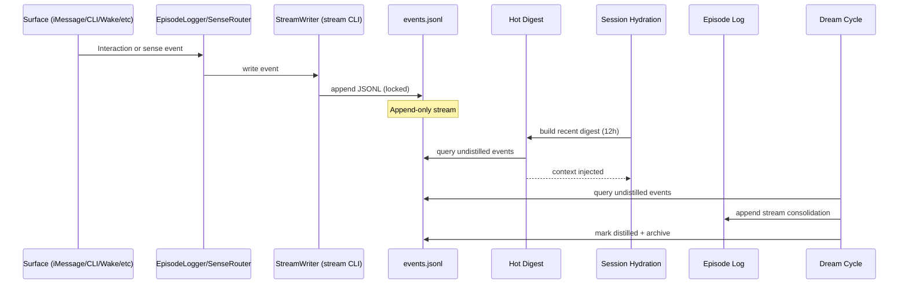

# Contiguous Memory System

Back to: [CLAUDE.md](../CLAUDE.md) | [Documentation Index](INDEX.md)

## Purpose

The contiguous memory system unifies all interaction surfaces into a single append-only event stream, then uses that stream to hydrate sessions, audit coverage, and distill long-term memory. The result is cross-surface continuity: recent activity from iMessage, CLI, wake/dream cycles, and sense events is visible everywhere that context is built.

## Design goals

- Single source of truth for recent activity across all surfaces
- Append-only, auditable log with deterministic replay
- Fast session hydration (hot digest) with safe fallbacks
- Fail-open logging (episode logs are still written even if stream write fails)
- Clear extension path for new surfaces and event types

## Architecture overview

```
Surfaces (iMessage, CLI, wake/dream, webhooks, email, calendar, location, X, Bluesky, ...)
        |
        v
EpisodeLogger / SenseRouter / stream CLI
        |
        v
~/.claude-mind/stream/events.jsonl (append-only)
        |                 |                    |
        |                 |                    +--> Stream audit (coverage, digest inclusion)
        |                 +--> Hot digest (last 12h) -> session hydration
        +--> Dream cycle distillation -> episode logs, mark distilled, archive
```

## Sequence diagram



## Event schema

Each event is a JSON object on its own line in `events.jsonl`.

Required fields:
- `schema_version` (string): currently `"1"`
- `id` (string): `evt_<unix_ts>_<random>`
- `timestamp` (string): ISO 8601 UTC with `Z` suffix
- `surface` (string): surface name (see list below)
- `type` (string): `interaction`, `sense`, `system`, or `handoff`
- `direction` (string): `inbound`, `outbound`, or `internal`
- `summary` (string): short digest anchor, one line
- `distilled` (bool): `false` until the dream cycle marks it `true`

Optional fields:
- `session_id` (string): Claude Code session ID (if known)
- `content` (string): fuller text body (may be truncated by writers)
- `metadata` (object): structured details for the event

Valid surfaces (from `lib/stream_writer.py`):
`cli`, `imessage`, `wake`, `dream`, `webhook`, `x`, `bluesky`, `email`,
`calendar`, `location`, `sense`, `system`

Example event:
```json
{
  "schema_version": "1",
  "id": "evt_1737180850_4f3a9b2c",
  "timestamp": "2026-01-17T23:20:50Z",
  "surface": "cli",
  "type": "interaction",
  "direction": "internal",
  "summary": "CLI session: documented stream audit workflow",
  "distilled": false,
  "session_id": "b1f36b6a-8f80-4d75-9bb1-2fdba6bca1b1",
  "content": "- Added stream audit docs\n- Verified surface coverage",
  "metadata": {
    "cwd": "/Users/claude/Developer/samara-main",
    "transcript_size": 48219
  }
}
```

## Storage layout

```
~/.claude-mind/stream/
├── events.jsonl                   # Append-only primary stream
└── archive/
    └── events-YYYY-MM-DD.jsonl     # Old events moved by archive job
```

## Writers and ingestion points

### 1) Samara app (iMessage and sense events)

`Samara/Samara/Mind/EpisodeLogger.swift` now dual-writes:
- Episode logs in `~/.claude-mind/memory/episodes/`
- Stream events via `~/.claude-mind/bin/stream`

Key entry points:
- `logExchange(...)` writes `surface=imessage` (or mapped surface) and `direction=inbound`
- `logOutbound(...)` writes `direction=outbound`
- `logSenseEvent(...)` writes `type=sense`, `direction=inbound`, and maps the sense to a surface

Surface mapping happens in `surfaceForSource(...)` and `logSenseEvent(...)`.

### 2) Claude Code sessions (CLI)

Session hooks are configured in `.claude/settings.json`:
- **SessionStart** -> `.claude/hooks/hydrate-session.sh`
- **SessionEnd** -> `scripts/distill-claude-session`

`scripts/distill-claude-session`:
- Summarizes the transcript into the daily episode log.
- Writes a stream event with `surface=cli`, `type=interaction`, `direction=internal`.
- Generates a structured handoff document and writes a second event with `type=handoff`.

### 3) Wake and dream cycles

`scripts/wake` and `scripts/dream` emit system events:
- Wake start and completion events (`surface=wake`, `type=system`)
- Dream start and completion events (`surface=dream`, `type=system`)
- Dream distillation writes a stream consolidation event

### 4) Sense events (external services)

External services emit sense events as JSON files under:
`~/.claude-mind/senses/*.json`

`SenseRouter` reads these events, routes them, and logs them through `EpisodeLogger`, which writes to the stream. This includes:
- Webhooks
- Location
- X / Bluesky
- Email
- Calendar meeting prep/debrief

### 5) Meeting prep/debrief (calendar)

`scripts/meeting-check` writes `meeting_prep` and `meeting_debrief` sense events into `~/.claude-mind/senses/`. These flow through `SenseRouter` and land in the stream as `surface=calendar`.

### 6) Manual or external ingestion

Use the stream CLI or Python API:
- `scripts/stream` wraps `lib/stream_cli.py`
- `lib/stream_writer.py` provides `StreamWriter` and `write_event`

## Hot digest builder

`lib/hot_digest_builder.py` builds a compact digest of recent activity for session hydration.

Key behaviors:
- Default window: last 12 hours
- Token budget allocation:
  - Conversations: 50 percent (iMessage, X, Bluesky, email)
  - Sessions: 35 percent (CLI, wake, dream)
  - System events: 15 percent (webhook, location, calendar, sense, system)
- Groups events into 30-minute windows for coherence
- Uses Ollama (`qwen3:8b`) to summarize large batches when enabled
- Deterministic fallback path with `--no-ollama`

Wrapper script: `scripts/build-hot-digest`

Cache:
- `~/.claude-mind/state/hot-digest.md`
- TTL: 900 seconds

## Session hydration

### CLI sessions (Claude Code)

`.claude/hooks/hydrate-session.sh` injects:
- Hot digest (if available)
- Open threads (`~/.claude-mind/state/threads.json`)
- Recent handoffs
- Pending sense events
- Episode hints and health alerts

This runs on **SessionStart** and is intentionally fast; it prefers cached digest output.

### iMessage sessions (Samara app)

`MemoryContext.buildHotDigest(...)` calls `build-hot-digest` with a 5 second timeout and injects the result into the iMessage context. If the digest is unavailable, it falls back to open threads.

## Distillation and lifecycle

The dream cycle converts hot stream events into warm memory:

1) Gather undistilled events:
```
stream --format json undistilled --before YYYY-MM-DD
```

2) Build deterministic fallback narrative:
`lib/stream_distill.py`

3) Optionally enrich via Claude for larger batches

4) Append narrative to episode file under `## Stream Consolidation`

5) Mark events as distilled:
```
stream mark-distilled --before YYYY-MM-DD
```

6) Archive old events (default 30 days):
```
stream archive --days 30
```

## Audit and observability

`lib/stream_audit.py` reports:
- Coverage by surface
- Missing surfaces in a time window
- Digest inclusion rate (how many summaries appear in the hot digest)
- Stale or missing handoff events

Wrapper script: `scripts/stream-audit`

Weekly audit runs from `scripts/dream` and writes:
`~/.claude-mind/state/stream-audit.json`

Schema validation:
```
stream validate
```

## Testing and verification

Automated:
- `Samara/SamaraTests/StreamIntegrationTests.swift` validates EpisodeLogger stream writes
- `tests/test_sync_core_script.py` ensures `sync-core` includes `lib` (prevents runtime drift)

Manual:
```
stream stats
stream query --hours 12
stream validate
stream-audit --format text
```

## Operational patterns

- Append-only with file locking for safe concurrent writes
- Asynchronous stream writes in Swift to avoid blocking message flow
- Fail open: stream failure does not block episode logging
- `summary` is the digest anchor; keep it short and specific
- `content` can be richer but is often truncated by writers
- Timestamps are UTC ISO 8601 with `Z`
- `schema_version` enables forward-compatible changes

## Extension guide: add a new surface

1) Add the surface enum in `lib/stream_writer.py` (`Surface`).
2) Update surface mappings in `Samara/Samara/Mind/EpisodeLogger.swift`.
3) Add the surface to hot digest categories in `lib/hot_digest_builder.py`.
4) Ensure sense events (or other inputs) emit to `~/.claude-mind/senses/` or call `stream write`.
5) Update tests or add coverage for the new surface.
6) Run `stream-audit` to confirm the surface shows up in coverage.
7) Update documentation if the surface is user-facing.

## API reference

### Python
```python
from lib.stream_writer import StreamWriter, Surface, EventType, Direction

writer = StreamWriter()
event = writer.create_event(
    surface=Surface.CLI,
    event_type=EventType.INTERACTION,
    direction=Direction.INBOUND,
    summary="User asked about memory architecture",
    content="Full conversation content...",
    session_id="optional-session-uuid",
    metadata={"emotional_texture": "curious, engaged"}
)
writer.write(event)
```

### CLI
```bash
stream write --surface cli --type interaction --direction inbound \
  --summary "User asked about memory" \
  --content "Full content..." \
  --metadata '{"emotional_texture":"curious"}'

stream query --hours 12 --surface imessage
stream undistilled --before 2026-01-17
stream mark-distilled evt_123_abc evt_456_def
stream archive --days 30
stream stats
stream validate
stream-audit --format text
```

## Troubleshooting

- Stream is empty: verify `~/.claude-mind/bin/stream` is present and executable. Run `sync-core`.
- Digest is empty: run `build-hot-digest --hours 12 --no-ollama` and check `events.jsonl`.
- Missing surfaces in audit: confirm the upstream sense event exists and `EpisodeLogger` mapping covers it.
- Hydration missing in CLI: verify `.claude/settings.json` SessionStart hook points to `.claude/hooks/hydrate-session.sh`.
- Calendar events missing: run `scripts/meeting-check` and confirm sense events are processed.

## File map

- `lib/stream_writer.py` - event schema and write/query/mark/archive
- `lib/stream_cli.py` - CLI implementation
- `lib/stream_validator.py` - schema validation
- `lib/stream_audit.py` - coverage and digest inclusion audit
- `lib/hot_digest_builder.py` - hot digest logic
- `scripts/build-hot-digest` - CLI wrapper
- `scripts/stream` - CLI wrapper
- `scripts/stream-audit` - audit wrapper
- `.claude/hooks/hydrate-session.sh` - SessionStart hydration
- `scripts/distill-claude-session` - SessionEnd distillation, stream events, handoffs
- `scripts/wake` / `scripts/dream` - lifecycle events and stream distillation
- `scripts/meeting-check` - meeting prep/debrief sense events
- `Samara/Samara/Mind/EpisodeLogger.swift` - dual-write integration
- `Samara/Samara/Mind/MemoryContext.swift` - hot digest injection for iMessage
